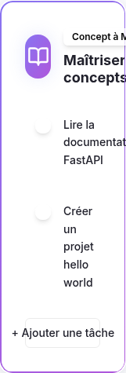
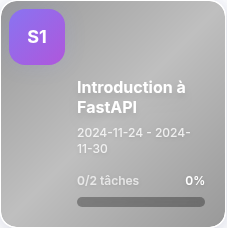
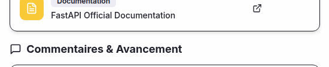

# RoadmapMentor

**Mentor-guided learning roadmap platform with progress tracking and AI-assisted roadmap generation.**

RoadmapMentor structures a learning plan into weeks, objectives, tasks, deliverables and resources. Mentors can build or validate roadmaps, while learners track their own progress, submit evidence and follow a clear progression over time.

## Preview

<p align="center">
  
</p>

| Weekly roadmap | Progress / achievements |
| --- | --- |
|  |  |

## Main capabilities

- **Mentor / learner roles** — distinct workflows for roadmap supervision and learning progress
- **Weekly roadmaps** — organize a program into weeks, objectives, tasks, deliverables and resources
- **Progress tracking** — learners mark tasks complete and can attach screenshots as evidence
- **Mentor validation** — weeks can be reviewed and validated by a mentor
- **Comments & follow-up** — learners can comment on weeks and keep progress discussions tied to the roadmap
- **AI roadmap generation** — generate structured learning plans by topic, duration and skill level
- **Notifications** — configurable email notifications for reminders, validation, progress and collaboration events

## Domain model

```text
Roadmap
  └── Week
       ├── Objectives
       │    └── Tasks
       │         └── Learner progress
       ├── Deliverables
       ├── Resources
       └── Comments
```

The application keeps mentor supervision separate from learner progress. A roadmap can therefore describe the same learning path while tracking completion independently for each learner.

## Stack

- **Frontend:** React 18, TypeScript, Vite
- **Data fetching:** TanStack Query
- **Backend:** Node.js, Express, TypeScript
- **Database:** PostgreSQL with Drizzle ORM
- **Database hosting:** Neon-compatible PostgreSQL
- **AI generation:** OpenAI SDK with schema validation
- **Validation:** Zod
- **UI:** Tailwind CSS / Radix-based components

## AI roadmap generation

The generator accepts a topic, skill level and roadmap duration, then returns validated structured weeks containing objectives, tasks, deliverables and resources.

Generated content is validated before insertion so malformed AI output does not become application data directly.

## Run locally

### Prerequisites

- Node.js
- PostgreSQL database
- an OpenAI API key, or a compatible configured AI integration

### Setup

```bash
git clone https://github.com/EagleFox31/RoadmapMentor.git
cd RoadmapMentor
npm install
```

Set at least the database connection:

```env
DATABASE_URL=postgresql://...
```

For direct OpenAI access:

```env
OPENAI_API_KEY=...
```

Then start the development server:

```bash
npm run dev
```

## Status

Active prototype focused on structured mentorship, measurable learner progress and faster roadmap creation.
